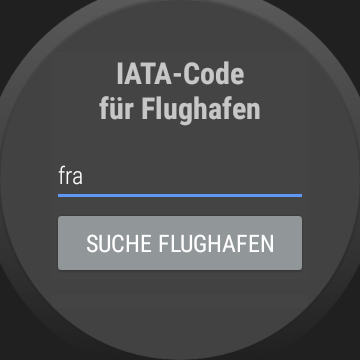
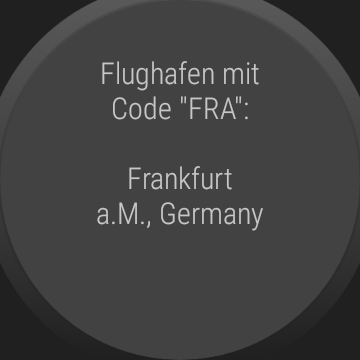

# WearOS-App: "IATA Codes"

This repository contains the source code (Android Studio project) for a simple WearOS app.

The app demonstrates how a WearOS app for querying 
[IATA (International Air Transport Association)](https://en.wikipedia.org/wiki/International_Air_Transport_Association) 
codes for airports (e.g. "FRA" for the airport "Frankfurt a.M., Germany") and 
airlines (e.g. "LH" for the airline "Lufthansa") could work.
It is **not for productive use** since it contains only a tiny subset of the IATA codes for airports and airlines.

The author of this app is not related to the IATA in any way.

----
## Screenshots

Screenshots were taken from emulator.

 

----
# License

See the [LICENSE file](LICENSE.md) for license rights and limitations (BSD 3-Clause License).
